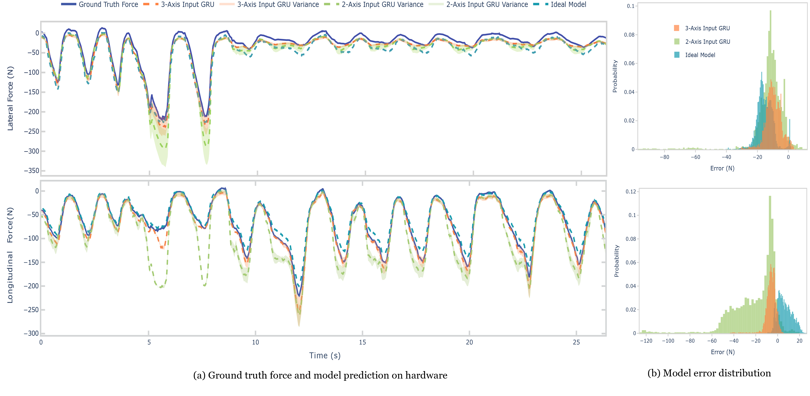

# GRU and GRBF Models for Force Estimation
The framework employs machine learning models to enhance the accuracy of force estimation and handle nonlinearity in sensor measurements:

---
## GRBF (Gaussian Radial Basis Functions)
An ideal model is generated using GRBF to estimate forces based on simulated sensor readings. This model assumes ideal conditions without accounting for real-world uncertainties like hysteresis and interference.
However, this provides a very quick solutions for your sensor designs. 
Further tuning, such as bias compensations can improve the mean force estimation error. 

!!! note

    GRBF is nonlinear model here. Linear interporation may work much faster if the sensitivity is designed to be a constant, aka linear force-sensor relationship.

---
## GRU (Gated Recurrent Unit)
To address real-world uncertainties, a GRU-based model is trained with hardware data. The GRU model takes sensor inputs and outputs both mean force estimates and their associated uncertainties. This is essential for detecting anomalies, such as interference from external magnetic fields.

