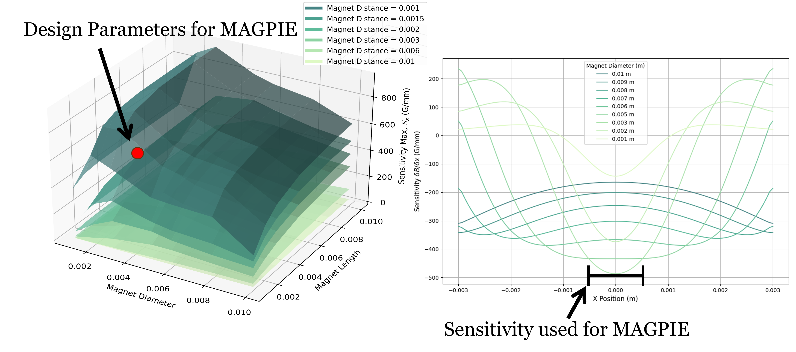
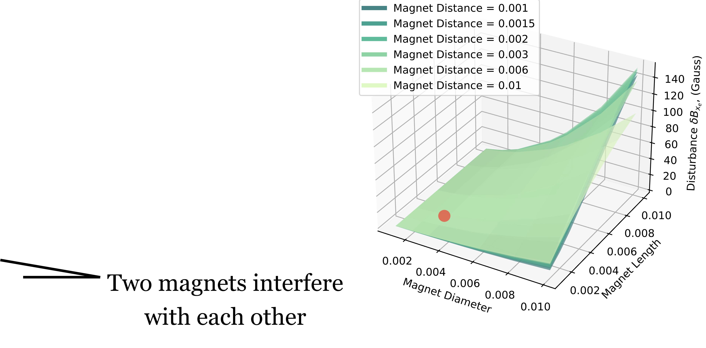

# Magnetic Simulation
The Hall effect sensors detect force through magnetic field changes caused by the motion of a nearby magnet. The sensitivity of the magnetic field changes with respect to sensor positioning is critical to the design.

## Magnetic Field Sensitivity:

The magnetic sensitivity is modeled as:

$$
\mathcal{S}=\frac{\delta \mathcal{B}}{\delta X}
$$

Where:
- $\mathcal{B}$ is the magnetic field strength
- $X$ is the relative distance between the sensor and magnet

## Interference Analysis

Magnetic sensors are highly sensitive to interference from external magnetic fields, such as those from neighboring magnets or nearby motors. The framework includes an analysis of possible interference sources:
- Earth's Magnetic Field: Typically negligible due to the proximity of stronger magnets.
- Neighboring Magnets: Nearby magnets, especially when the gripper is closed, can interfere with measurements. The framework designs the sensing mechanism to minimize this interference.

