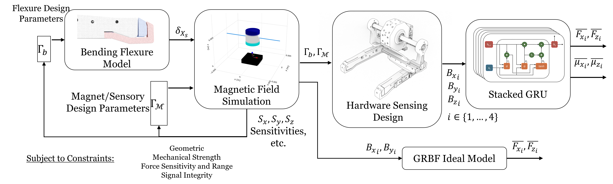

# Computational Design Framework for MAGPIE

## Overview

MAGPIE (Multi-modal Adaptive Gripper for multi-Pedal Impact-resilient End-effector) is designed to serve as both a foot and a gripper in limbed robotics. The end-effector integrates 8-axis force sensing, which is achieved through Hall effect sensors and compliant mechanisms, providing measurements for both ground contact and grasping forces.

To optimize the design of MAGPIE's sensing mechanism, a computational design framework has been developed. This framework simulates various configurations of sensors, magnets, and flexures to achieve the desired force range, sensitivity, and robustness against interference.

---

## Framework Components

The computational design framework is divided into several key components: beam simulation, magnetic simulation, and interference analysis. These components interact to generate an optimal design for the force sensing mechanism.

